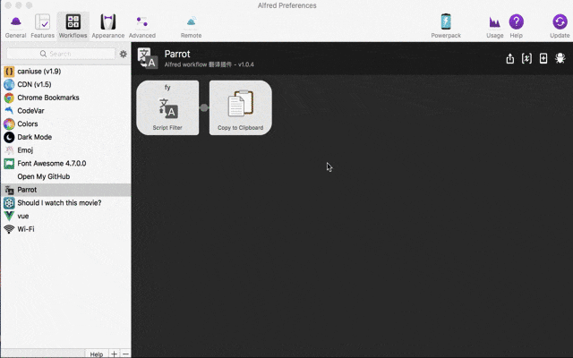

# alfred-parrot


## 👉 安装

```
$ npm install --global alfred-parrot
```

执行上述命令行后, 稍后会在 alfred workflow 中显示出安装后的 alfred-parrot

*Requires [Node.js](https://nodejs.org) 4+ and the Alfred [Powerpack](https://www.alfredapp.com/powerpack/).*

## 💻 使用


## 💪 其他特性

1. 朗读翻译结果, 输入 `fy` + `:`的形式, 如 `fy :thanks` ;
2. 多语种转换, `fy` + `空格` + `需要转换的单词` + `to` + `目标语言`, 如英转日: `fy thanks to 日语` 或 `fy love to jp`;
3. 复制翻译结果, 输入 `fy` 然后输入需要查询的单词,  如: fy love; 回车复制翻译结果

## 😒 用前配置

支持有道和百度, 个人推荐使用有道,注册方式如下:

1. 注册[有道](http://ai.youdao.com/), 注册后复制自己的 `appid` 和 `key`  到 Alfred workflow 中
2. 注册[百度](http://api.fanyi.baidu.com/api/trans/product/index), 注册后复制自己的 `appid` 和 `key`  到 Alfred workflow 中

配置格式(json)

- 有道: `config_youdao: {"appid":"你的有道 appid", "key":"你的有道 key"}`
- 百度: `config_baidu: {"appid":"你的百度 appid", "key":"你的百度 key"}`

注: 如果同时配置了有道和百度, 会首先调用有道接口.



## 💙 最后

如果遇到任何问题, 可以提交 issue , 你的反馈对我很重要!
另外,喜欢的话不妨给个 Star 😍

## License

MIT © [haojen ma](http://haojen.github.io)
